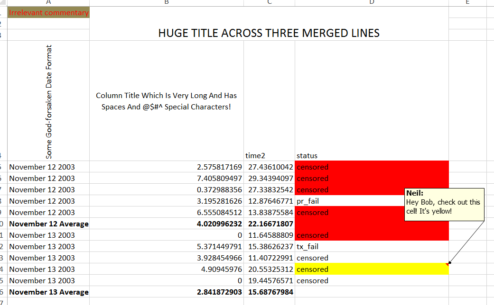
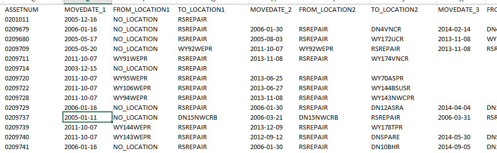

```{r setup, include=FALSE}
knitr::opts_chunk$set(echo = FALSE, fig.align = 'center')
options(tibble.width=70)
```

# admin

## contact, notes

|
-------------|---------------------------------------------------------------------
date format  | YYYY-MM-DD -- *All Hail ISO8601!!!*
instructor   | Neil Montgomery
email        | neilm@mie.utoronto.ca
office       | BA8137
office hours | W11-1
website      | portal (announcements, grades, suggested exercises, etc.)
github       | https://github.com/sta286-winter-2017 (lecture material, code, etc.)

Lecture notes and other course timing matters will be organized by *lecture number* and not *lecture date*, due to two lecture sections.

## evaluation, book, tutorials

what | when | how much
-----|------|---------
midterm 1 | 2017-02-13 | 20%
midterm 2 | 2017-03-27 | 30%
exam | TBA | 50%

The book is Walpole, R.E., Myers, R.H., Myers, S.L., Ye, K., 2012. *Probability & statistics for engineers & scientists.* 9th edition.

I will suggest exercises from this book each week. Your TA will work through some of them in tutorial each week. 

**Tutorials start TBA.**

## software 

The course begins and ends with data analysis, with a long stretch of probability theory in the middle. 

Data analysis requires a computer. Also, some concepts can be illustrated using simulation, which also requires a computer. 

We will be using `R`. It's pretty good at data analysis. 

language | interpreter | integrated development environment
---------|-------------|-----------------------------------
`R`      | `R`         | `RStudio`

Some detailed instructions and suggestions for installation and configuration appear on the course website.

I will try to impart some data analysis workflow wisdom throughout the course. Some already appears in the detailed instructions. 

# MATLAB SUCKS!

# what is a dataset?

## most datasets are rectangles

Columns are the *variables*.

The top row has the names of the variables; possibly chosen wisely.

Rows are the *observations* of measurements taken on *units*.

There are no averages, no comments (unless in a "comment" variable), no colors, no formatting, no plots, no capes!

## not a dataset



## not a dataset



## an oil readings dataset (wide version)

```{r, message=FALSE}
library(tidyverse)
library(readxl)
oil <- read_excel("oil_readings.xlsx")
oil
```

## oil readings with `Ident` and `TakenBy` properly treated

```{r}
oil <- oil %>% mutate(Ident = factor(Ident), TakenBy = factor(TakenBy))
oil
```


## oil readings dataset (long version)

```{r}
oil_long <- oil %>% 
  gather(element, ppm, -Ident:-TakenBy)
oil_long
```


## the main questions

* where did the data come from?
    + were the units chosed randomly from a population?
    + were the units randomly assigned into groups?
* what are the (joint) *distributions* of the data?

## random sample, experiment, observational data

Sometimes the data come from a *random sample* from a larger *population*, in which case statements about the sample can apply to the population using laws of probability.

\pause (Not a focus of this course.)

\pause Sometimes data come from an *experiment* where units are randomly assigned to different *levels* of one or more *factors*, in which cause cause-and-effect can be inferred using laws of probability.

\pause Often the data are just some records of what happened. Grander inferences might be made, but only on a subject-matter basis.

## distribution (informally)

* A *distribution* is a 
    + Complete description of...
    + ...the possible values of one or more variables... 
    + ...and the relative frequency of those values.
    
* A dataset contains **empirical** information about distribution(s) that can be assessed
    + numerically
    + graphically  
    
\pause through a process called *exploratory data analysis*

## a taxonomy of variables

* Numerical or categorical?
    + Numerical: length, ppm, time-to-event, etc.
    + Categorical: yes/no, colour, etc.
    + Lots of grey areas even in this classification!
        - Categories can have an inherent order
        - "Likert scale" (strongly disagree coded as 1 and so on...)
        
* Numerical variables could be discrete (counting something) or continuously measured. 

